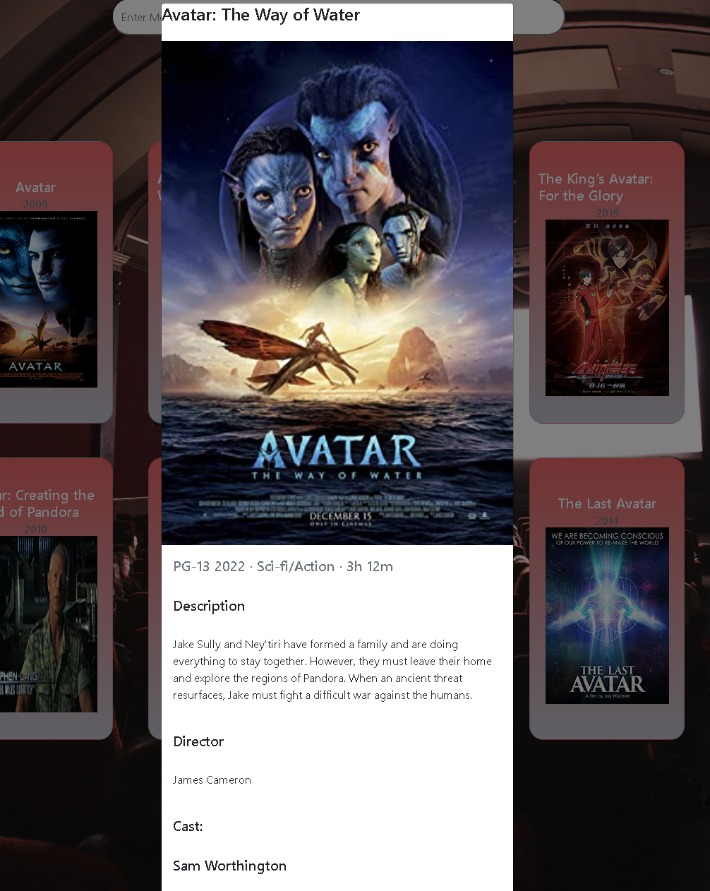
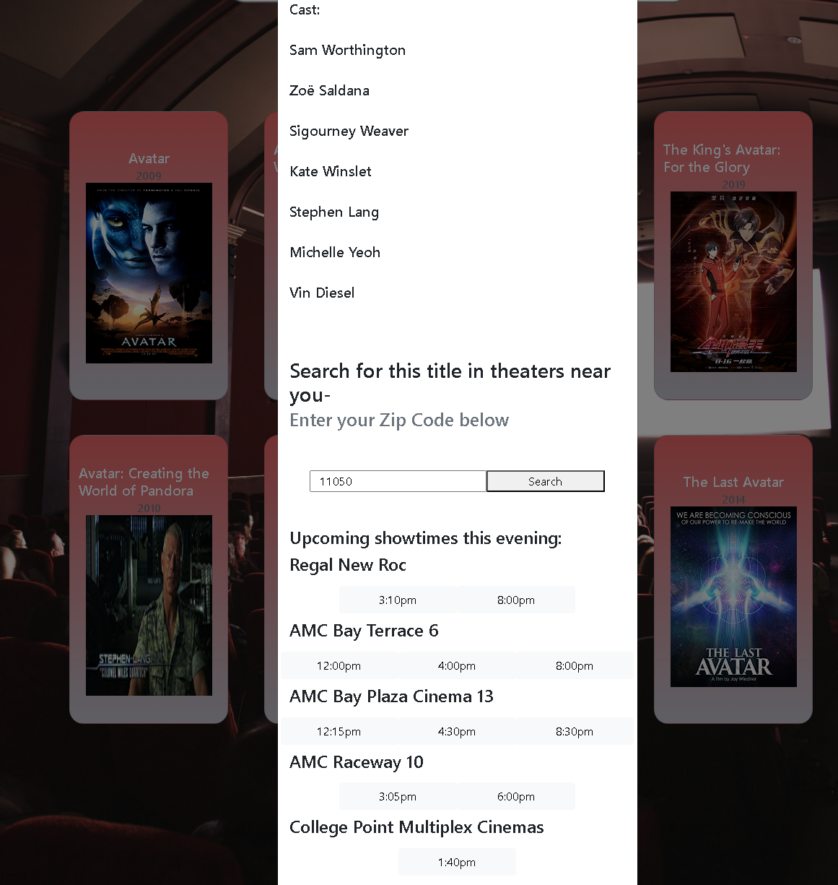

# Movie Search Engine

## Description

This is a movie search/lookup application that is also able to check if a selected search result is currently playing in nearby theaters and display its showtimes if so. The front page takes an input from the user and returns the top 8 search results (in card/movie poster format) for the movie. When one of the cards is selected, a modal is displayed with more information on plot description, actors, etc. A zip code can be entered and if the movie is playing nearby, the showtimes and theater is displayed.

[GitHub Repo](https://github.com/pvlln/project1-group-awesome)

[Website](https://pvlln.github.io/project1-group-awesome/)

Preview Images:

## Usage

Enter movie name at the top of the page to search different movie titles. The top 8 movie names, years, and posters are displayed in cards. Click a card to display the title and poster as well as plot description, director, and cast information in a larger modal. Search to see if the movie is playing nearby by entering a zip code. Nearby theater and show times are displayed. 

## Known Issues

Some movies which titles only consist of numbers can cause an error in the application. There is code in the JavaScript that attempts to fix this, but it is not foolproof. For example, if '65' is entered, no results are displayed; however, '2001' will work. 

The call to Serp API has a lag or delay before the movie info items are displayed.

## Credits

1. Natasha Mann (tutor) - helped fix an error with empty modals popping up when empty space on the page was clicked.
